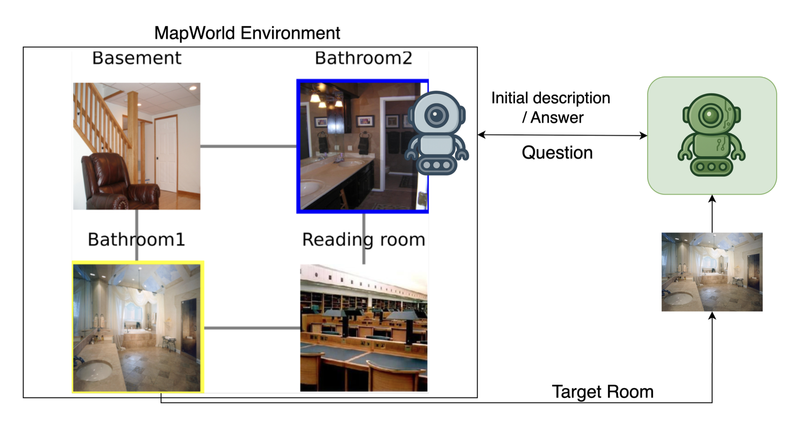

# ESCAPE ROOM

## Introduction

#### Game Details
Escape Room is a multimodal collaborative game between two agents based on the Mapworld Environment. Here, one agent - EXPLORER is stuck inside the mapworld, who can explore the world but has limited observability (i.e. can only observe the current room and possible exits at each time step) (Can add large enough memory part #TODO). There's another agent, GUIDE outside the mapworld, with no observability and cannot explore the world. GUIDE has been given only an Image of an Escape Room. EXPLORER needs to reach this escape room and issue an ESCAPE command to win the Game. EXPLORER and GUIDE can only communicate with each other via a text channel

As shown in the below figure, Game starts with GUIDE sending the description of the Escape Room. EXPLORER checks if its the same room, If yes, it can respond with the tag "ESCAPE" and the game ends there. If not, it can ask for more deatils starting with tag "QUESTION:". Then, GUIDE needs to provide answer, by using the tag "ANSWER:" in a greater detail, or include minor details (Useful only in Ambiguous cases). If EXPLORER is definitely sure that this is not the room, it can make a move to another room by using the tag "MOVE:"

